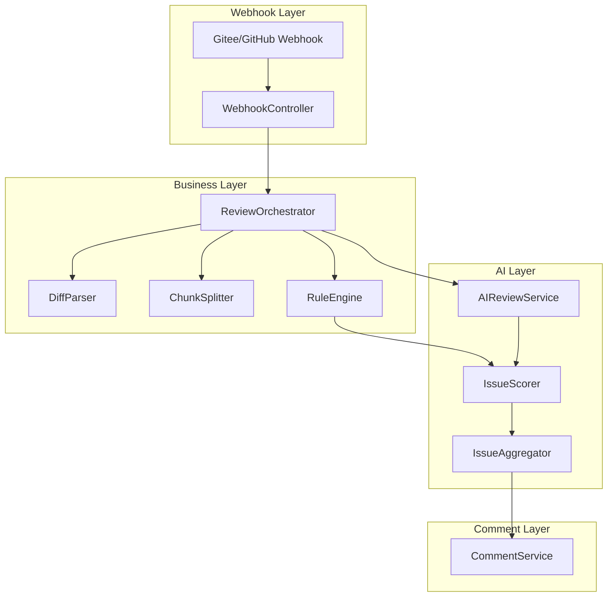

# CodeGuardian

AI-powered code review system that automatically analyzes code changes in Pull Requests, detects potential issues, and provides improvement suggestions.

## Core Features

- ✅ **Automatic PR Code Analysis**：Parse Diff Patch and extract added code for review
- ✅ **Rule Engine**：Detect common issues based on rules, such as null pointer risks, unhandled exceptions, etc.
- ✅ **AI Review**：Use LLM for deep code analysis and provide high-value suggestions
- ✅ **Concurrent Processing**：Use CompletableFuture to execute review tasks concurrently, improving speed
- ✅ **Intelligent Scoring**：Rank and filter issues based on a configurable scoring system
- ✅ **Multi-platform Support**：Support Gitee and GitHub Pull Requests
- ✅ **Extensible Design**：Modular architecture, easy to add new features and support new languages
- ✅ **Exception Handling**：Built-in retry mechanism to handle API timeouts and errors

## System Architecture



### Architecture Description

- **Webhook Layer**：Receive PR events
- **Business Layer**：Schedule review process, parse Diff, split code chunks, execute rule checks
- **AI Layer**：Call DeepSeek for review, score issues, aggregate issues
- **Comment Layer**：Finally comment review results to PR
- **Data Flow**：Webhook → ReviewOrchestrator → DiffParser/ChunkSplitter/RuleEngine → AIReviewService → IssueScorer → IssueAggregator → CommentService

### Core Components

1. **WebhookController**：Receive PR webhook and trigger review tasks
2. **ReviewOrchestrator**：Control the entire review process, handle concurrency and exceptions
3. **DiffParser**：Parse PR diff, extract added code to generate CodeChunk
4. **ChunkSplitter**：Split large code chunks into small ones suitable for AI review
5. **RuleEngine**：Detect code issues based on rules
6. **AIReviewService**：Call AI models for deep code review
7. **IssueScorer**：Score issues for ranking and filtering
8. **IssueAggregator**：Aggregate, rank, and filter issues
9. **CommentService**：Generate and publish PR comments

## Quick Start

### Requirements

- JDK 1.8+
- Maven 3.6+
- Spring Boot 2.7+
- DeepSeek API Key (for AI review)

### Configuration

1. **Modify configuration file**：`src/main/resources/application.properties`

```properties
# Server configuration
server.port=8080

# DeepSeek API configuration
deepseek.api.url=https://api.deepseek.com/v1/chat/completions
deepseek.api.key=your_api_key

# Gitee API configuration
gitee.api.url=https://gitee.com/api/v5
gitee.api.token=your_gitee_token

# GitHub API configuration
github.api.url=https://api.github.com
github.api.token=your_github_token
```

2. **Modify scoring configuration**：`src/main/resources/config/scoring.json`

3. **Modify rule configuration**：`src/main/resources/config/rules/java-rule.json`

4. **Modify AI review prompt**：`src/main/resources/prompt/java-review.prompt`

### Build & Run

```bash
# Build project
mvn clean package

# Run project
java -jar target/code-guardian-1.0.0-SNAPSHOT.jar
```

### Configure Webhook

#### Gitee Webhook

1. Go to Gitee repository → Settings → Webhooks
2. Add Webhook, URL: `http://your-server:8080/webhook/gitee`
3. Select trigger event: Pull Request
4. Save Webhook configuration

#### GitHub Webhook

1. Go to GitHub repository → Settings → Webhooks
2. Add Webhook, URL: `http://your-server:8080/webhook/github`
3. Select trigger event: Pull requests
4. Save Webhook configuration

## Usage

1. **Create Pull Request**：Create a PR on Gitee or GitHub
2. **Automatic Review**：Webhook will automatically trigger code review
3. **View Comments**：After review, the system will add comments to the PR with found issues and improvement suggestions

## Project Structure

```
src/
├── main/
│   ├── java/com/codeguardian/
│   │   ├── api/             # API interfaces
│   │   ├── application/      # Application services
│   │   ├── config/           # Configuration
│   │   ├── domain/           # Domain models and services
│   │   ├── infrastructure/   # Infrastructure
│   │   └── AiCrApplication.java  # Application entry
│   └── resources/            # Resource files
│       ├── config/           # Configuration files
│       ├── prompt/           # AI prompt templates
│       └── application.properties  # Application configuration
└── test/                     # Test code
```

## Extension Guide

### Add New Language Support

1. Add language-specific rule files in `src/main/resources/config/rules/`
2. Add language detection logic in `DiffParser`
3. Add language-specific prompt templates in `PromptBuilder`
4. Add language-specific rule processing logic in `RuleEngine`

### Add New AI Model

1. Implement `LLMService` interface
2. Add model-specific configuration in `application.properties`
3. Register the new implementation in Spring configuration

## Contribution Guide

1. **Fork the project**：Fork the project to your own account on GitHub
2. **Clone the project**：`git clone https://github.com/your-username/code-guardian.git`
3. **Create a branch**：`git checkout -b feature/your-feature`
4. **Commit changes**：`git commit -m "Add your feature"`
5. **Push changes**：`git push origin feature/your-feature`
6. **Create Pull Request**：Create a PR on GitHub

## License

This project is licensed under the MIT License. See the [LICENSE](LICENSE) file for details.

## Contact

- Project URL：[https://github.com/fufufuuuu/code-guardian](https://github.com/fufufuuuu/code-guardian)
- Issue Tracker：[Issues](https://github.com/fufufuuuu/code-guardian/issues)

---

**CodeGuardian** - Make code review smarter and more efficient!
