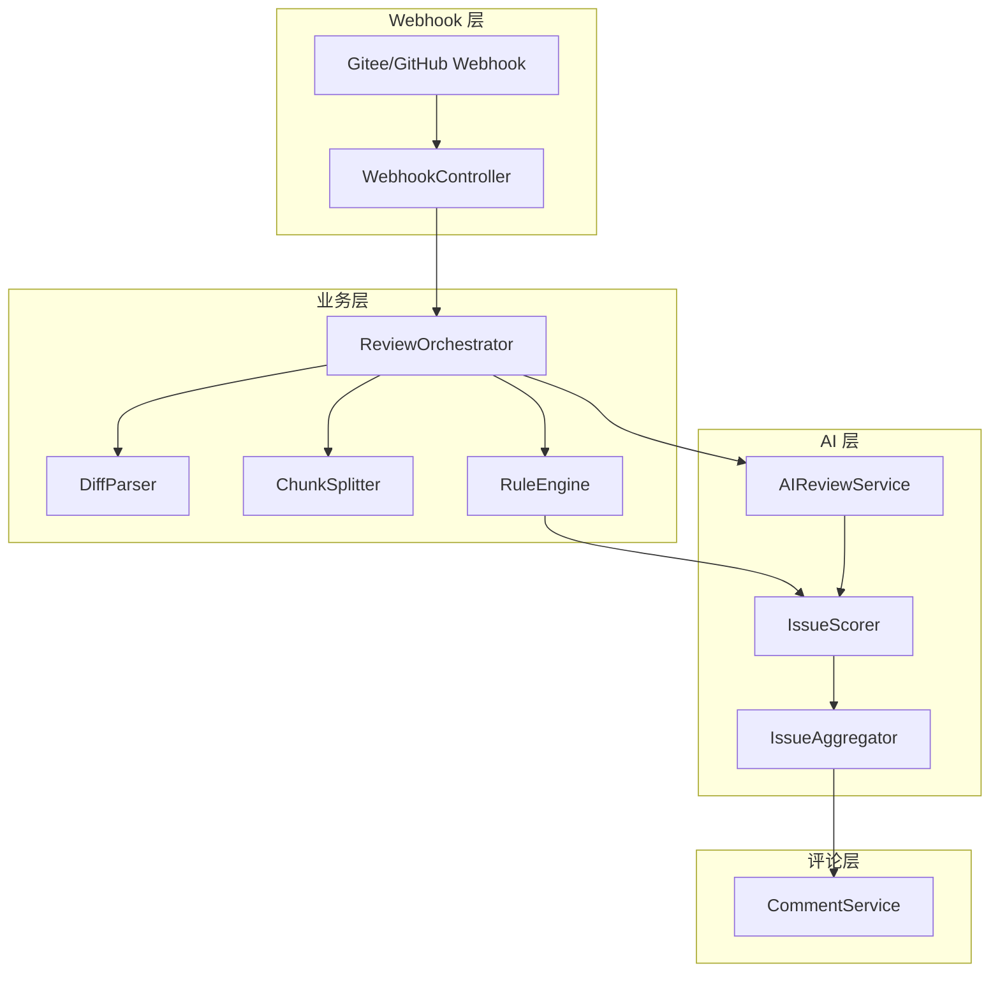

# CodeGuardian

AI 驱动的代码审查系统，自动分析 Pull Request 中的代码变更，直接在 PR 评论中提供高价值的建议，帮助团队发现潜在问题。。

AI-powered code review system that automatically analyzes code changes in Pull Requests, detects potential issues, and provides improvement suggestions.

## 核心功能 | Core Features

- ✅ **自动分析 PR 代码**：解析 Diff Patch，提取新增代码进行审查
- ✅ **规则引擎**：基于规则检测常见问题，如空指针风险、异常未处理等
- ✅ **AI 审查**：使用 LLM 进行深度代码分析，提供高价值建议
- ✅ **并发处理**：使用 CompletableFuture 并发执行审查任务，提高速度
- ✅ **智能评分**：基于配置的评分系统对问题进行排序和过滤
- ✅ **多平台支持**：支持 Gitee 和 GitHub Pull Request
- ✅ **可扩展设计**：模块化架构，易于添加新功能和支持新语言
- ✅ **异常处理**：内置重试机制，处理 API 超时和错误

## 系统架构 | System Architecture



### 架构说明 | Architecture Description

- **Webhook 层**：接收 PR 事件
- **业务层**：调度审查流程、解析 Diff、分割代码块、执行规则检查
- **AI 层**：调用 DeepSeek 审查、打分、聚合 Issue
- **评论层**：最终将审查结果评论到 PR
- **数据流**：Webhook → ReviewOrchestrator → DiffParser/ChunkSplitter/RuleEngine → AIReviewService → IssueScorer → IssueAggregator → CommentService

### 核心组件 | Core Components

1. **WebhookController**：接收 PR webhook 并触发审查任务
2. **ReviewOrchestrator**：控制整个审查流程，处理并发和异常
3. **DiffParser**：解析 PR diff，提取新增代码生成 CodeChunk
4. **ChunkSplitter**：将大的代码块分割成小的代码块，适合 AI 审查
5. **RuleEngine**：基于规则检测代码问题
6. **AIReviewService**：调用 AI 模型进行深度代码审查
7. **IssueScorer**：对问题进行评分，用于排序和过滤
8. **IssueAggregator**：聚合、排序和过滤问题
9. **CommentService**：生成并发布 PR 评论

## 快速开始 | Quick Start

### 环境要求 | Requirements

- JDK 1.8+
- Maven 3.6+
- Spring Boot 2.7+
- DeepSeek API Key (用于 AI 审查)

### 配置 | Configuration

1. **修改配置文件**：`src/main/resources/application.properties`

```properties
# 服务器配置
server.port=8080

# DeepSeek API 配置
deepseek.api.url=https://api.deepseek.com/v1/chat/completions
deepseek.api.key=your_api_key

# Gitee API 配置
gitee.api.url=https://gitee.com/api/v5
gitee.api.token=your_gitee_token

# GitHub API 配置
github.api.url=https://api.github.com
github.api.token=your_github_token
```

2. **修改评分配置**：`src/main/resources/config/scoring.json`

3. **修改规则配置**：`src/main/resources/config/rules/java-rule.json`

4. **修改 AI 审查提示**：`src/main/resources/prompt/java-review.prompt`

### 构建和运行 | Build & Run

```bash
# 构建项目
mvn clean package

# 运行项目
java -jar target/code-guardian-1.0.0-SNAPSHOT.jar
```

### 配置 Webhook

#### Gitee Webhook

1. 进入 Gitee 仓库 → 设置 → Webhooks
2. 添加 Webhook，URL 填写：`http://your-server:8080/webhook/gitee`
3. 选择触发事件：Pull Request
4. 保存 Webhook 配置

#### GitHub Webhook

1. 进入 GitHub 仓库 → Settings → Webhooks
2. 添加 Webhook，URL 填写：`http://your-server:8080/webhook/github`
3. 选择触发事件：Pull requests
4. 保存 Webhook 配置

## 使用方法 | Usage

1. **创建 Pull Request**：在 Gitee 或 GitHub 上创建 PR
2. **自动审查**：Webhook 会自动触发代码审查
3. **查看评论**：审查完成后，系统会在 PR 中添加评论，包含发现的问题和改进建议

## 项目结构 | Project Structure

```
src/
├── main/
│   ├── java/com/codeguardian/
│   │   ├── api/             # API 接口
│   │   ├── application/      # 应用服务
│   │   ├── config/           # 配置
│   │   ├── domain/           # 领域模型和服务
│   │   ├── infrastructure/   # 基础设施
│   │   └── AiCrApplication.java  # 应用入口
│   └── resources/            # 资源文件
│       ├── config/           # 配置文件
│       ├── prompt/           # AI 提示模板
│       └── application.properties  # 应用配置
└── test/                     # 测试代码
```

## 扩展指南 | Extension Guide

### 添加新语言支持

1. 在 `src/main/resources/config/rules/` 中添加对应语言的规则文件
2. 在 `DiffParser` 中添加语言检测逻辑
3. 在 `PromptBuilder` 中添加对应语言的提示模板
4. 在 `RuleEngine` 中添加对应语言的规则处理逻辑

### 添加新的 AI 模型

1. 实现 `LLMService` 接口
2. 在 `application.properties` 中添加对应模型的配置
3. 在 Spring 配置中注册新的实现

## 贡献指南 | Contribution Guide

1. **Fork 项目**：在 GitHub 上 fork 项目到自己的账号
2. **克隆项目**：`git clone https://github.com/your-username/code-guardian.git`
3. **创建分支**：`git checkout -b feature/your-feature`
4. **提交代码**：`git commit -m "Add your feature"`
5. **推送代码**：`git push origin feature/your-feature`
6. **创建 Pull Request**：在 GitHub 上创建 PR

## 许可证 | License

本项目采用 MIT 许可证。详见 [LICENSE](LICENSE) 文件。

This project is licensed under the MIT License. See the [LICENSE](LICENSE) file for details.

## 联系方式 | Contact

- 项目地址：[https://github.com/fufufuuuu/code-guardian](https://github.com/fufufuuuu/code-guardian)
- 问题反馈：[Issues](https://github.com/fufufuuuu/code-guardian/issues)

---

**CodeGuardian** - 让代码审查更智能、更高效！

**CodeGuardian** - Make code review smarter and more efficient!
